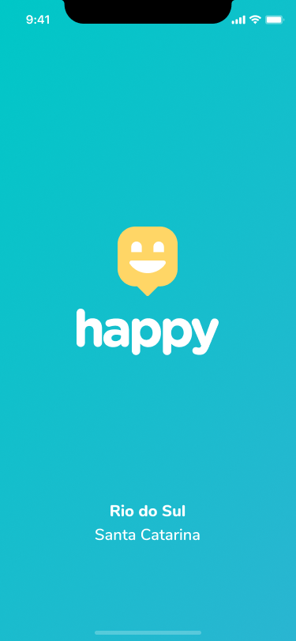
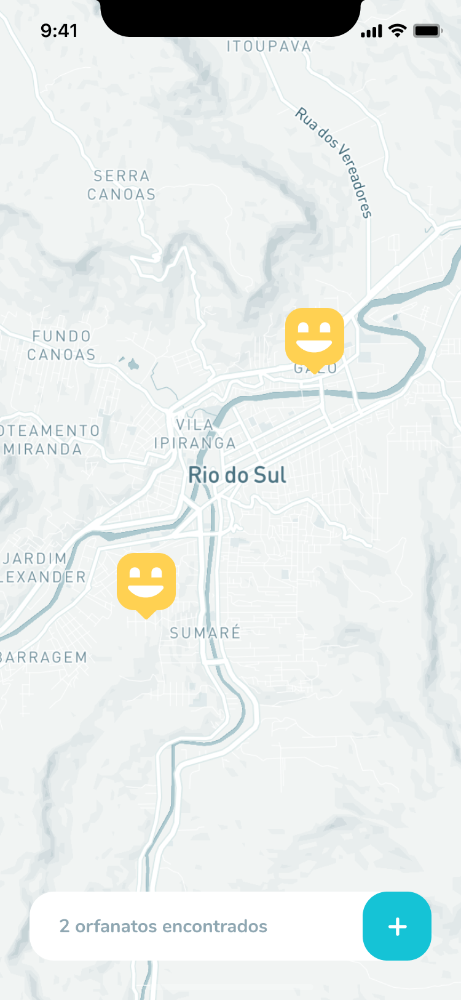

<p align="center">
      
</p>

<p align="center">:rocket: Plataforma desenvolvida para facilitar a localização de orfanatos durante a semana NLW (Next Level Week) #03.</p>

<p align="center">
 <a href="#computer-Tecnologias">Tecnologias</a> •
 <a href="#Screenshots">Screenshots</a> • 
 <a href="#rocket-Como-executar-o-projeto">Como executar o projeto</a> • 
 <a href="#memo-licença">Licença</a>
</p>

<hr/>

<div id="status">
    <h3 align="center">Status do projeto</h3>
    <h4 align="center">
      🚧 O projeto está em desenvolvimento. 🚧
    </h4>
  </div>

## :computer: Tecnologias
<ul>
  <li><a href="https://nodejs.org/">Node.js</a></li>
  <!-- <li><a href="https://expo.io/">Expo</a></li> -->
  <li><a href="https://www.typescriptlang.org/">Typescript</a></li>
  <li><a href="https://reactjs.org/">React</a></li>
  <!-- <li><a href="https://reactnative.dev/">React Native</a></li> -->
  <li><a href="https://expressjs.com/en/api.html#express">Express</a></li>
</ul>

## Screenshots

### Mobile
<p align="center">
  

  
</p>

### Web
<p align="center" style="display: flex; justify-content: space-around; max-width: 820px;">
  

  
</p>

## :rocket: Como executar o projeto

<p>Podemos considerar este projeto como sendo divido em três partes:</p>
<ul>
  <li>Back End (pasta server)</li>
  <li>Front End (pasta web)</li>
  <li>Mobile (<!-- pasta mobile -->não foi criado ainda)</li>
</ul>

<!-- <p>💡Tanto o Front End quanto o Mobile precisam que o Back End esteja sendo executado para funcionar.</p> -->

### Pré-requisitos

<p>Antes de começar, você vai precisar ter instalado em sua máquina as seguintes ferramentas:
<a href="https://git-scm.com">Git</a>, <a href="https://nodejs.org/">Node.js</a> e o <a href="https://yarnpkg.com/">Yarn</a>. 
Além disto é bom ter um editor para trabalhar com o código como o <a href="https://code.visualstudio.com/">VSCode</a>.</p>

### 🎲 Rodando o Back End (servidor)

```bash
# Clone este repositório
$ git clone https://github.com/ViniciusCCO/nlw-03

# Acesse a pasta do projeto no terminal/cmd
$ cd nlw-03

# Vá para a pasta server
$ cd server

# Instale as dependências
$ yarn install

# Crie o banco de dados
$ yarn typeorm migration:run

# Execute a aplicação
$ yarn dev

# O servidor inciará na porta:3333 - acesse http://localhost:3333 
```

### 🧭 Rodando a aplicação web (Front End)

```bash
# Clone este repositório
$ git clone https://github.com/ViniciusCCO/nlw-03

# Acesse a pasta do projeto no seu terminal/cmd
$ cd nlw-03

# Vá para a pasta da aplicação Front End
$ cd web

# Instale as dependências
$ yarn install

# Execute a aplicação
$ yarn start

# A aplicação será aberta na porta:3000 - acesse http://localhost:3000
```

<!-- ### 📱Rodando a aplicação mobile

<p>Para rodar a aplicação mobile você precisa de um celular com o app do expo instalado ou um emulador android/ios.</p>

```bash
# Clone este repositório
$ git clone https://github.com/ViniciusCCO/nlw-03

# Acesse a pasta do projeto no seu terminal/cmd
$ cd nlw-03

# Vá para a pasta da aplicação mobile
$ cd mobile

# Instale as dependências
$ yarn install

# Execute a aplicação
$ yarn start
```
<p>Depois leia o QRCode com o app do expo ou execute no emulador.</p> -->

## :memo: Licença

Este projeto esta sob a licença MIT.

Feito com ❤️ por Vinicius Amorim 👋🏽 [Entre em contato!](https://www.linkedin.com/in/vinicius-amorim-6505/)
